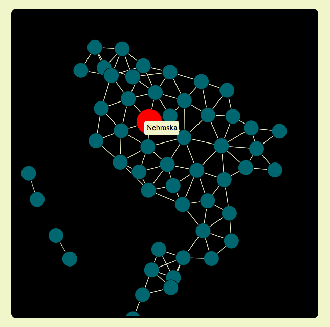

# Playing with Data

[Live](http://graphsarefun.com)

A data visualization project built using JavaScript, d3.js, HTML, CSS and SVG.

### Description

I undertook this project to learn the d3.js library. I carefully selected public data from different departments in the U.S. government that would create meaningful scatter, bubble and force directed charts. I manipulated properties including force and charge and added css transition effects to make the charts come to life.

### Instructions

#### Select one of the graphs from the menu.

* “Bordering States;” nodes are drag-able.
* “Percent Homeless;” force changes on bubbles with mouseover.
* “Are Younger Countries Richer;” countries are highlighted with mouseover.

  

  

  

### Technologies Used
* d3.js
* JavaScript
* HTML
* CSS
* SVG

### Future Direction
* More variety of chart type including vornoi and chord diagrams.
* More data related to social issues.
* Charts with realtime updates using AJAX.
